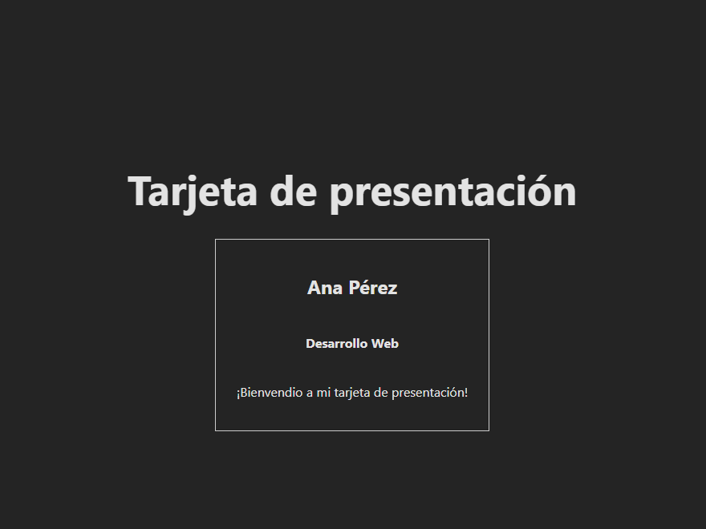

# 📘 Clase 1: Introducción a React

En esta primera clase nos enfocamos en comprender los fundamentos esenciales de React, una biblioteca de JavaScript utilizada para construir interfaces de usuario dinámicas y reutilizables.

## 🧠 Temas abordados

- ✅ ¿Qué es React y para qué se utiliza?
- ✅ Diferencias entre **Functional Components** y **Class Components**
- ✅ Ventajas de usar componentes funcionales en proyectos modernos
- ✅ Introducción a **Vite** como herramienta de construcción rápida
- ✅ Creación de un proyecto base con `Vite + React (JavaScript)`
- ✅ Principios básicos para definir y renderizar componentes
- ✅ Introducción al uso de **props** para pasar datos entre componentes

## 🛠️ ¿Qué encontrarás en esta carpeta?

- Código base generado por Vite
- Ejemplos de componentes funcionales simples
- Ejercicios donde se practican conceptos como:
  - Creación de múltiples componentes
  - Comunicación entre componentes mediante props
  - Uso básico de JSX

## 🚀 Objetivo de esta clase

Comprender la estructura de un proyecto React moderno y sentar las bases para construir interfaces reutilizables utilizando componentes funcionales. Al finalizar esta clase, deberías ser capaz de:

- Crear un nuevo proyecto React desde cero usando Vite
- Escribir y renderizar componentes funcionales
- Entender la importancia de los props para la reutilización de componentes

## 👾 Proyecto
Para reforzar los conocimientos aprendidos se hizo como practica un proyecto con vite utilizando el template de react(JavaScript), donde se creo como componente tarjetas de presentación.

### Crear proyecto con vite
```bash
npm create vite@latest mi-tarjeta --template react
cd mi-tarjeta
npm install
```
### Captura del proyecto


## ⚙️ Instalación

### Prerrequisitos

- Node.js

### Clonación e instalación

```bash
git clone https://github.com/MLuisaGP/Devf_introduccion_react.git
cd proyecto
npm install  
```


### Ejecucion del proyecto
```bash
npm run dev # Corre el servidor con vite
```


## 💻 Autor

- Luisa Galaz - [@MLuisaGP](https://github.com/MLuisaGP)


## 📬 Contacto
Si tienes preguntas o sugerencias:

Email: luisagalazmp@gmail.com

LinkedIn: [linkedin.com/in/mc-maria-luisa-galaz-palma-9ab30a19a](linkedin.com/in/mc-maria-luisa-galaz-palma-9ab30a19a)