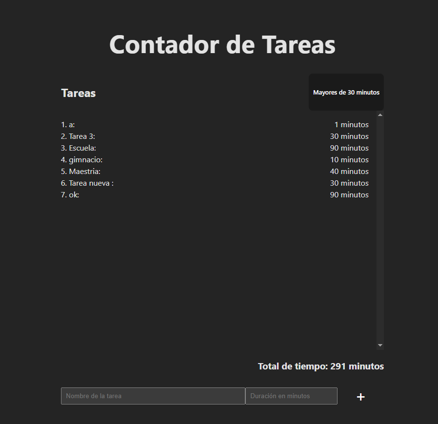

# 📘 Clase 3: Hooks useEffect y useMemo en React

En esta tercera clase exploramos dos hooks fundamentales de React: **useEffect** y **useMemo**. Estos hooks permiten controlar efectos secundarios y optimizar el rendimiento de las aplicaciones mediante memorias inteligentes.

## 🧠 Temas abordados

- ✅ ¿Qué es el hook `useEffect` y cómo se utiliza?
- ✅ Casos comunes de uso de `useEffect` (peticiones, temporizadores, sincronización)
- ✅ ¿Qué es `useMemo` y cuándo conviene utilizarlo?
- ✅ Diferencias clave entre `useEffect` y `useMemo`
- ✅ Cómo optimizar componentes evitando cálculos innecesarios

## 🚀 Objetivo de esta clase

Comprender el uso práctico de `useEffect` para manejar efectos secundarios y de `useMemo` para evitar cálculos innecesarios. Aprender a usarlos correctamente para mejorar el rendimiento de aplicaciones React.

Al finalizar esta clase, es:

- Usar `useEffect` para ejecutar funciones en momentos específicos del ciclo de vida de un componente
- Implementar `useMemo` para memorizar valores derivados de props o estados
- Mejorar la eficiencia de tus componentes funcionales

## 👨‍💻 Proyecto

Como práctica, se desarrolló una aplicación de **seguimiento de tareas**, donde el usuario puede:

- Registrar tareas realizadas
- Registrar el tiempo dedicado a cada tarea
- Calcular el tiempo total invertido

### Instrucciones

Imagina que estamos desarrollando una aplicación sencilla para llevar un seguimiento de las tareas y calcular el tiempo total que una persona ha dedicado a cada tarea. Queremos asegurarnos de que los cálculos de tiempo solo se realicen cuando sea necesario, y no cada vez que el componente se renderice. Aquí es donde entran los hooks `useEffect` y `useMemo`.

### Crear el proyecto con Vite

```bash
npm create vite@latest seguimiento-tareas --template react
cd seguimiento-tareas
npm install
```

### Captura del proyecto



## ⚙️ Instalación

### Prerrequisitos

- Node.js

### Clonación e instalación

```bash
git clone https://github.com/MLuisaGP/Devf_introduccion_react.git
cd class_3/proyecto/contador-tareas
npm install
```

### Ejecución del proyecto

```bash
npm run dev # Inicia el servidor de desarrollo con Vite
```

## 💻 Autor

- Luisa Galaz - [@MLuisaGP](https://github.com/MLuisaGP)

## 📬 Contacto

¿Tienes preguntas o sugerencias?

- Email: luisagalazmp@gmail.com  
- LinkedIn: [linkedin.com/in/mc-maria-luisa-galaz-palma-9ab30a19a](https://linkedin.com/in/mc-maria-luisa-galaz-palma-9ab30a19a)
