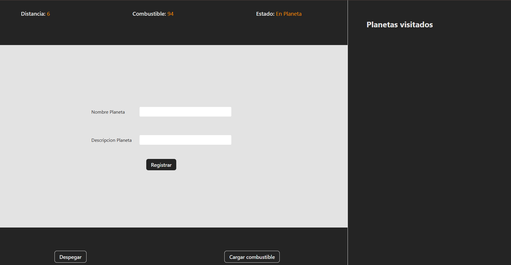

# 📘 Clase 4: Ciclo de Vida de los Componentes en React

En esta clase nos enfocamos en entender el **ciclo de vida de los componentes** dentro de React, especialmente en su enfoque funcional con hooks. Exploramos cómo controlar los momentos clave del ciclo de un componente para construir comportamientos complejos de forma eficiente.

## 🧠 Temas abordados

- ✅ Ciclo de vida en componentes funcionales
- ✅ Hooks clásicos como `useEffect` y su relación con el ciclo de vida
- ✅ Simulación de eventos como montaje, actualización y desmontaje
- ✅ Coordinación entre frontend (React) y backend (Python)

## 🚀 Objetivo de esta clase

Comprender cómo funcionan los ciclos de vida en componentes React funcionales, y aplicar este conocimiento para construir aplicaciones que respondan a eventos del sistema, controlen recursos, y sincronicen datos entre cliente y servidor.

Al finalizar esta clase, deberías ser capaz de:

- Identificar y utilizar las fases del ciclo de vida en React funcional
- Aplicar correctamente `useEffect` para simular montaje, actualización y desmontaje
- Integrar una aplicación React con un backend Python para almacenar datos
- Comprender cómo los efectos controlan el comportamiento de una aplicación en tiempo real

## 👨‍💻 Proyecto

Como práctica, se desarrolló un **panel de control estilo nave espacial**, donde el usuario puede:

- Despegar y avanzar consumiendo combustible
- Medir la distancia recorrida en cada misión
- Descubrir nuevos planetas durante el viaje
- Registrar los planetas en una bitácora conectada a un backend en Python

Esta actividad permite visualizar el uso del ciclo de vida en una aplicación interactiva y persistente.

### Crear el proyecto con Vite

```bash
npm create vite@latest panel-nave --template react
cd panel-nave
npm install
```

### Backend (Python - Flask por ejemplo)

- API para almacenar planetas descubiertos
- Conexión desde React para enviar registros de la bitácora

### Captura del proyecto



## ⚙️ Instalación

### Prerrequisitos

- Node.js
- Python 3
- Backend corriendo en Flask, FastAPI u otro framework similar

### Clonación e instalación

```bash
git clone https://github.com/MLuisaGP/Devf_introduccion_react.git
cd class_4/practica/explorador-espacial
npm install
```
en otra terminal ejecutar el backend
```bash
# Asegúrate de tener también el backend corriendo
cd class_4/practica/backend
python app/app.py
```
### Ejecución del proyecto

```bash
npm run dev # Inicia el frontend
# Ejecutar el servidor Python por separado (por ejemplo con Flask)
```

## 💻 Autor

- Luisa Galaz - [@MLuisaGP](https://github.com/MLuisaGP)

## 📬 Contacto

¿Tienes preguntas o sugerencias?

- Email: luisagalazmp@gmail.com  
- LinkedIn: [linkedin.com/in/mc-maria-luisa-galaz-palma-9ab30a19a](https://linkedin.com/in/mc-maria-luisa-galaz-palma-9ab30a19a)
