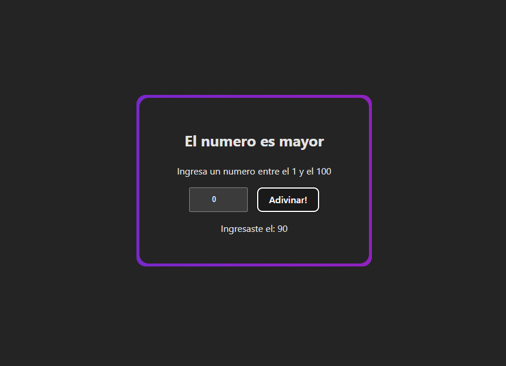

# 📘 Clase 5: Conditional Rendering y Composición de Componentes en React

En esta clase abordamos dos conceptos clave para construir interfaces dinámicas y escalables en React: el **renderizado condicional** y la **composición de componentes**.

## 🧠 Temas abordados

- ✅ ¿Qué es el **conditional rendering** y cómo se implementa en React?
- ✅ Técnicas comunes: operadores ternarios, condicionales cortocircuitados, y más
- ✅ ¿Qué es la **composición de componentes**?
- ✅ Ventajas de dividir la interfaz en componentes reutilizables y modulares

## 🚀 Objetivo de esta clase

Aprender a controlar qué elementos se muestran en pantalla según el estado de la aplicación, y cómo organizar el código usando componentes compuestos de forma clara y reutilizable.

Al finalizar esta clase, deberías ser capaz de:

- Mostrar elementos diferentes en base a condiciones lógicas
- Usar estructuras condicionales para controlar la interfaz de usuario
- Dividir tu aplicación en componentes pequeños, reutilizables y bien organizados
- Combinar múltiples componentes para crear interfaces completas

## 👨‍💻 Proyecto

Como práctica, desarrollamos un juego interactivo llamado **"Adivina el Número"**, donde el usuario debe adivinar un número generado aleatoriamente. Dependiendo del resultado, se muestra:

- Un mensaje de éxito si adivina correctamente
- Una pista (mayor o menor) si falla

### Características del proyecto

- Uso de **conditional rendering** para mostrar mensajes diferentes según la respuesta
- Uso de **composición de componentes** para estructurar la interfaz de juego
- Juego reiniciable al ganar

### Crear el proyecto con Vite

```bash
npm create vite@latest adivina-numero --template react
cd adivina-numero
npm install
```

### Captura del proyecto



## ⚙️ Instalación

### Prerrequisitos

- Node.js

### Clonación e instalación

```bash
git clone https://github.com/MLuisaGP/Devf_introduccion_react.git
cd class_5/proyecto/adivina-el-numero
npm install
```

### Ejecución del proyecto

```bash
npm run dev # Inicia el servidor de desarrollo con Vite
```

## 💻 Autor

- Luisa Galaz - [@MLuisaGP](https://github.com/MLuisaGP)

## 📬 Contacto

¿Tienes preguntas o sugerencias?

- Email: luisagalazmp@gmail.com  
- LinkedIn: [linkedin.com/in/mc-maria-luisa-galaz-palma-9ab30a19a](https://linkedin.com/in/mc-maria-luisa-galaz-palma-9ab30a19a)
