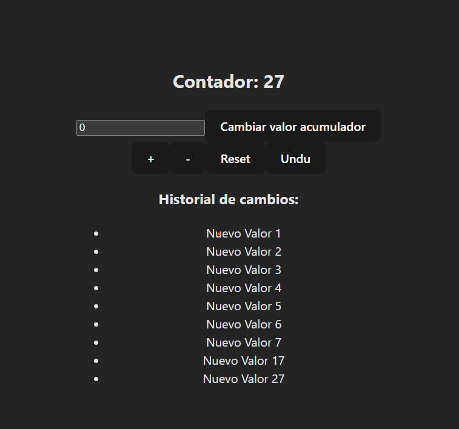

# 📘 Clase 6: Hooks Avanzados en React

En esta clase profundizamos en los **hooks avanzados** de React para manejar referencias, optimizar funciones y gestionar estados complejos. Nos enfocamos en `useRef`, `useCallback` y `useReducer`.

## 🧠 Temas abordados

- ✅ ¿Qué es `useRef` y para qué se utiliza?
- ✅ Uso de `useCallback` para evitar recreaciones innecesarias de funciones
- ✅ Gestión de estados complejos con `useReducer`
- ✅ Comparación entre `useState` y `useReducer`
- ✅ Casos de uso combinando múltiples hooks avanzados

## 🚀 Objetivo de esta clase

Comprender cómo los hooks avanzados pueden ayudarte a escribir código más limpio, eficiente y escalable al manejar referencias DOM, funciones memorizadas y estructuras de estado complejas.

Al finalizar esta clase, deberías ser capaz de:

- Utilizar `useRef` para manejar referencias persistentes entre renders
- Optimizar funciones pasadas como props con `useCallback`
- Organizar estados complejos y múltiples acciones con `useReducer`
- Combinar varios hooks avanzados para resolver problemas reales

## 👨‍💻 Proyecto

Como práctica, desarrollamos un **contador interactivo** donde:

- El estado del contador se gestiona con `useReducer`
- Se utiliza `useCallback` para manejar acciones de incremento y reseteo
- Se emplea `useRef` para contar cuántas veces se ha renderizado el componente

Este ejercicio permite visualizar cómo los hooks avanzados mejoran la eficiencia y organización del código.

### Crear el proyecto con Vite

```bash
npm create vite@latest contador-juego --template react
cd contador-juego
npm install
```

### Captura del proyecto



## ⚙️ Instalación

### Prerrequisitos

- Node.js

### Clonación e instalación

```bash
git clone https://github.com/MLuisaGP/Devf_introduccion_react.git
cd class_6/practica/contador-juego
npm install
```

### Ejecución del proyecto

```bash
npm run dev # Inicia el servidor de desarrollo con Vite
```

## 💻 Autor

- Luisa Galaz - [@MLuisaGP](https://github.com/MLuisaGP)

## 📬 Contacto

¿Tienes preguntas o sugerencias?

- Email: luisagalazmp@gmail.com  
- LinkedIn: [linkedin.com/in/mc-maria-luisa-galaz-palma-9ab30a19a](https://linkedin.com/in/mc-maria-luisa-galaz-palma-9ab30a19a)
