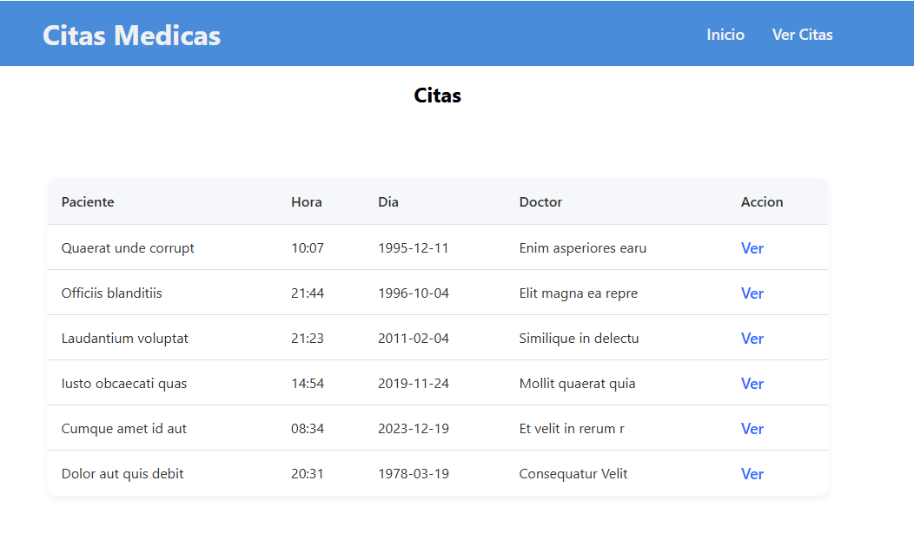

# 📘 Clase 7: Manejo de Rutas en React con React Router DOM

En esta clase nos enfocamos en aprender cómo implementar **rutas** en una aplicación React utilizando la biblioteca `react-router-dom`. Esto permite dividir la aplicación en múltiples páginas accesibles mediante URL, simulando una navegación tradicional.

## 🧠 Temas abordados

- ✅ ¿Qué es `react-router-dom` y por qué es importante?
- ✅ Instalación y configuración básica de rutas en React
- ✅ Creación de rutas con `<Route>` y agrupación con `<Routes>`
- ✅ Navegación entre páginas usando `<Link>` y `useNavigate`
- ✅ Rutas dinámicas y uso de parámetros
- ✅ Organización de rutas públicas y privadas

## 🚀 Objetivo de esta clase

Entender cómo dividir una aplicación React en diferentes vistas y cómo navegar entre ellas utilizando React Router. Esto permite construir aplicaciones más estructuradas, escalables y fáciles de mantener.

Al finalizar esta clase, deberías ser capaz de:

- Configurar una estructura de rutas en un proyecto React
- Crear navegación entre páginas usando enlaces y botones
- Capturar parámetros de la URL para mostrar información dinámica
- Organizar vistas lógicas como Home, Perfil, Dashboard, etc.

## 👨‍💻 Proyecto

En muchas clínicas y consultorios médicos, la gestión de citas se realiza manualmente o con sistemas poco eficientes, lo que genera problemas como pérdida de citas, confusión en los horarios y dificultad en el acceso a la información del paciente.

### Objetivo del proyecto

Construir una **plataforma web en React** que permita a pacientes y doctores gestionar sus citas de forma eficiente, utilizando `react-router-dom` para navegar entre:

- Página principal
- Registro y login de usuarios
- Vista del paciente para agendar o consultar citas
- Vista del doctor para revisar sus consultas programadas
- Página de error o rutas no encontradas

### Crear el proyecto con Vite

```bash
npm create vite@latest citas-medicas --template react
cd citas-medicas
npm install
npm install react-router-dom
```

### Captura del proyecto



## ⚙️ Instalación

### Prerrequisitos

- Node.js

### Clonación e instalación

```bash
git clone https://github.com/MLuisaGP/Devf_introduccion_react.git
cd class_7/proyecto/citas-medicas
npm install
```

### Ejecución del proyecto

```bash
npm run dev # Inicia el servidor de desarrollo con Vite
```

## 💻 Autor

- Luisa Galaz - [@MLuisaGP](https://github.com/MLuisaGP)

## 📬 Contacto

¿Tienes preguntas o sugerencias?

- Email: luisagalazmp@gmail.com  
- LinkedIn: [linkedin.com/in/mc-maria-luisa-galaz-palma-9ab30a19a](https://linkedin.com/in/mc-maria-luisa-galaz-palma-9ab30a19a)
